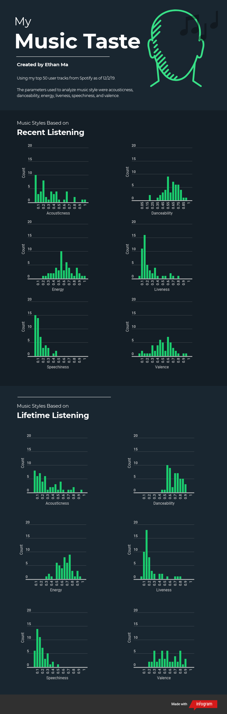
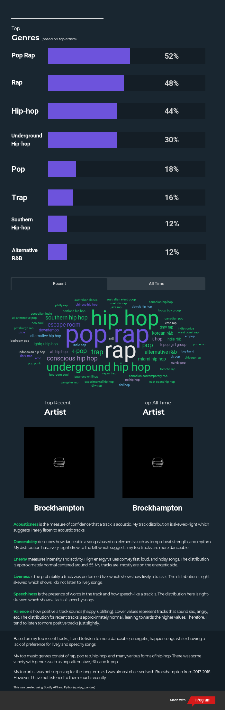

# My Music Taste
Collecting data from the Spotify Web API using Spotipy and analyzing a user's top 50 tracks.

https://infogram.com/music-taste-1h8n6m1llv9m6xo?live

## Motivation

I listen to music for hours every day and I figured there was enough data to do some anaylsis. Even though I know what I tend to listen to, I was interested to classify them. Additionally, I could see a ranking of my top genres, my top tracks, and my top artists. It is unfortunate Spotify only gives data on the top 50, it would have been much more interesting to see a larger range of tracks.

## Tools Used

  *Spotify API
  *Python Libraries
    ..*pandas
    ..*spotipy
  *Infogram(data visualization)

## Future Plans
Learn more javascript to create interactive webapp. Will also need to figure out Spotify authorization for different users.

## Credits
https://github.com/tgel0/spotify-data
https://spotipy.readthedocs.io/en/latest/
https://github.com/plamere/spotipy/tree/master/examples
